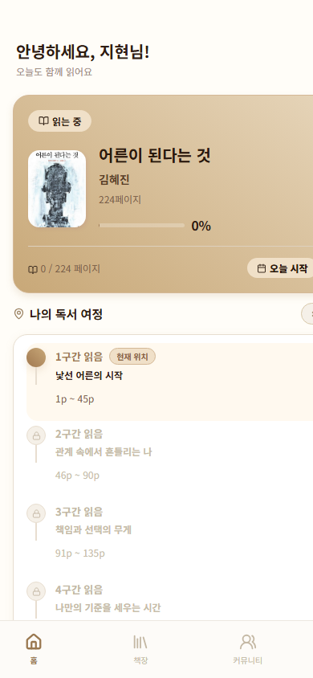
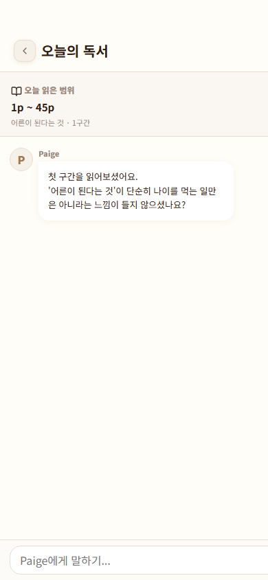
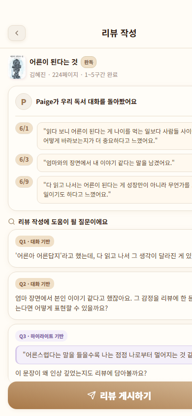
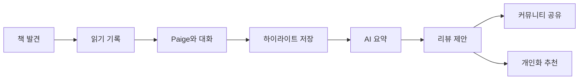
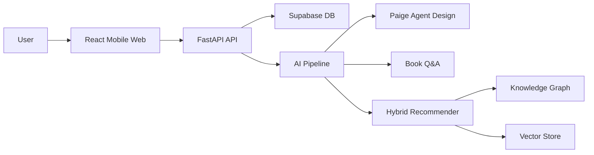

# BookJukBookJuk 책국책국

> AI 독서 도우미 **Paige**와 개인화 추천을 결합한 모바일 독서 경험 서비스  
> 책을 발견하고, 읽고, 대화하고, 기록으로 남기는 과정을 하나의 흐름으로 설계했습니다.


## Screens

| Home | Paige Chat | AI Review |
|---|---|---|
|  |  |  |

## 프로젝트 소개

**책국책국**은 독서가 단순히 “읽고 끝나는 일”이 아니라, 생각을 정리하고 다른 책으로 확장되는 경험이 되도록 만든 모바일 웹 앱입니다.

사용자는 읽는 중인 책을 중심으로 독서 구간을 기록하고, AI 독서 도우미 Paige와 대화하며, 하이라이트와 요약을 남기고, 마지막에는 리뷰 초안까지 도움받을 수 있습니다. 별점과 리뷰만 남기는 기존 독서 기록 서비스보다 **읽는 과정의 맥락**을 더 중요하게 다루는 것이 핵심입니다.

## 핵심 사용자 경험



- **읽는 중인 책 중심 홈**: 현재 책, 진행률, 구간별 독서 여정을 한 화면에서 확인합니다.
- **책별 Paige 채팅**: 특정 책과 구간을 컨텍스트로 삼아 감상과 질문을 이어갑니다.
- **하이라이트와 요약**: 인상 깊은 문장과 메모를 저장하고, Paige가 오늘의 독서를 요약합니다.
- **AI 리뷰 제안**: 대화와 하이라이트를 바탕으로 리뷰 초안을 제안하되, 최종 게시 권한은 사용자에게 둡니다.
- **서재와 커뮤니티**: 읽는 중인 책, 완독 기록, 다른 독자의 리뷰를 함께 탐색합니다.

## 주요 기능

| 영역 | 설명 |
|---|---|
| 모바일 독서 홈 | 읽는 책, 현재 페이지, 구간별 진행 상태를 카드와 타임라인으로 표현 |
| Paige 책별 채팅 | 책 제목과 읽은 범위를 기반으로 독서 대화를 이어가는 인터페이스 |
| 하이라이트 저장 | 문장, 감정 태그, 개인 메모를 함께 기록하는 독서 노트 흐름 |
| 오늘의 요약 | 저장된 대화와 하이라이트를 바탕으로 AI 요약 카드 제공 |
| AI 리뷰 작성 | 독서 대화 회고, 질문 프롬프트, 리뷰 초안 생성 UX 설계 |
| 책 검색/서재 | 책 추가, 읽는 중인 책 목록, 완독/진행 상태 관리 화면 |
| 커뮤니티 | 별점뿐 아니라 독서 기간, 대화 횟수, 하이라이트 등 독서 흔적을 함께 노출 |

## AI 기능

### Paige Agent

Paige는 책국책국의 AI 독서 도우미입니다. 단순 챗봇이 아니라 사용자의 독서 상태와 책 컨텍스트를 바탕으로 다음 행동을 제안하는 에이전트로 설계했습니다.

- `state_change`: 읽는 중, 별점 등록, 리뷰 작성 등 독서 상태 변경
- `book_qna_collect`: 책별 질문과 감상 수집
- `review_assist`: 대화와 하이라이트 기반 리뷰 초안 제안
- `review_nudge`: 리뷰 작성을 돕는 질문과 리마인드
- `book_recommend`: 사용자 맥락 기반 도서 추천
- `smalltalk`: 자연스러운 일상 대화와 독서 흐름 연결

중요한 원칙은 **AI가 리뷰를 자동 게시하지 않는 것**입니다. Paige는 초안과 질문을 제안하지만, 최종 제출은 항상 사용자가 직접 수행하도록 설계했습니다.

### Hybrid Recommendation

추천 시스템은 단순 인기순 추천이 아니라, 책 메타데이터와 사용자 독서 이력을 함께 사용하는 하이브리드 파이프라인을 목표로 합니다.

- **Knowledge Graph**: 책, 작가, 주제, 키워드 관계를 그래프로 구성
- **Vector Search**: OpenAI 임베딩 기반 의미 유사도 계산
- **RippleNet Scoring**: 그래프 기반 사용자 선호 전파 모델 활용
- **Hybrid Score**: Graph score와 Vector score를 결합
- **Diversity/XAI**: MMR 다양성 보정과 LLM 기반 추천 이유 생성

## Architecture



## 기술적 구현 포인트

- **모바일 우선 UI**: React 18과 Vite 기반 SPA로 구현하고, 실제 앱처럼 하단 탭과 모바일 화면 폭을 기준으로 설계했습니다.
- **경험 중심 플로우**: 홈, 채팅, 하이라이트, 요약, 리뷰 작성이 끊기지 않도록 독서 구간 기반의 흐름을 구성했습니다.
- **FastAPI 백엔드**: 책 검색, 책 상세, 댓글, 컬렉션, 추천 API를 분리된 라우터 구조로 구성했습니다.
- **Supabase 연동 구조**: 사용자, 책, 컬렉션, 리뷰, 추천 파이프라인 데이터를 저장할 수 있는 스키마와 시드 스크립트를 정리했습니다.
- **AI 추천 파이프라인**: KG 생성, 임베딩 저장, 사용자 프로필 스코어링, 다양성 보정, 설명 생성을 단계별 모듈로 분리했습니다.
- **Paige 설계 문서화**: 채널 어댑터와 Core Orchestrator를 분리해 MyPage, 책 상세, 오프라인 서점 채널로 확장 가능한 구조를 설계했습니다.

## Project Structure

```text
BookJukBookJuk
├─ frontend/   React + Vite 기반 모바일 웹 앱
├─ backend/    FastAPI API, Supabase repository/service/router
├─ ai/         Book Q&A, hybrid recommender, Paige 설계 문서
└─ docs/       README 이미지와 프로젝트 보조 문서
```

## 현재 구현 상태

| 구분 | 상태 |
|---|---|
| 모바일 UI 데모 | 홈, 서재, 책별 채팅, 하이라이트, 요약, 리뷰 작성, 검색, 커뮤니티 화면 구현 |
| FastAPI API | 책 표지, 추천, 책 검색/상세, 댓글, 컬렉션 API 구조 구현 |
| Hybrid Recommender | KG, Vector, 사용자 프로필, 다양성 보정, 추천 설명 모듈 구성 |
| Paige Core | 에이전트 플로우와 DB/API 설계 완료, Core Orchestrator 구현은 진행 예정 |
| 데이터 연동 | 일부 화면은 데모 데이터 기반, 추천/도서 API는 Supabase 및 AI 파이프라인 연동 구조 보유 |

## 한 줄로 정리하면

책국책국은 **독서 기록 서비스에 AI 대화, 요약, 리뷰 제안, 개인화 추천을 연결한 프로젝트**입니다.  
읽는 순간의 생각을 놓치지 않고, 그 기록이 다음 책과 다음 대화로 이어지도록 설계했습니다.
